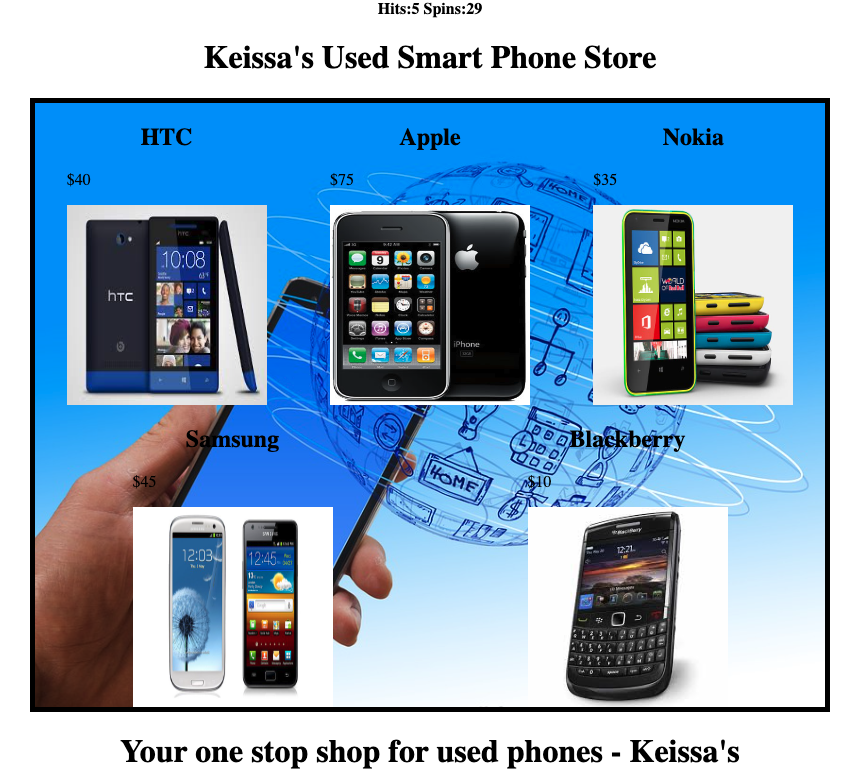

During the WOD 5 assignment, we dove  into the use of variables to improve the display of Smart Phone products in a web application. 
The primary aim is to avoid hard-coding product information and enhance code maintainability. The process begins with duplicating SmartPhoneProducts1 and renaming it to SmartPhoneProducts1_variables. 
Product data, such as names, prices, and image URLs, is stored in JavaScript variables. These variables are then used to dynamically populate product information on the web page.

For more information, view the link below:
https://dport96.github.io/ITM352/morea/050.variables_data_types/experience-SmartPhoneProducts1_variables.html

While performing the WOD, I thought everything was moving smoothly for the majority of it. I slowed down on the parts where we had to find and replace variables but not in a challenging aspect.
What worked well for me was reading the instructions and watching the screencast prior to performing the WOD. Rather than viewing it for when I was stuck, I had a better idea of the outcome for each 
step. Overall, I found this WOD to be easier than some of the previous ones.

Initially, to prepare for this WOD, I read the instructions, watched the screencast, and if I had any further questions, I would look it up.
Similar to the previous WODs, I sort of walked through it and marked the steps. One thing that I did differently was watching the screencast prior.
I found that this has helped me gain a better understanding on the tasks.

Something that I could've done better was check to see that my audio was recording prior to recording and doing the entire WOD. For the next WOD, I think I want to try incorportating pseudocode 
into the process just to get more used to it and using it as a draft to see if the codes will actually work in the way that I want it to.

