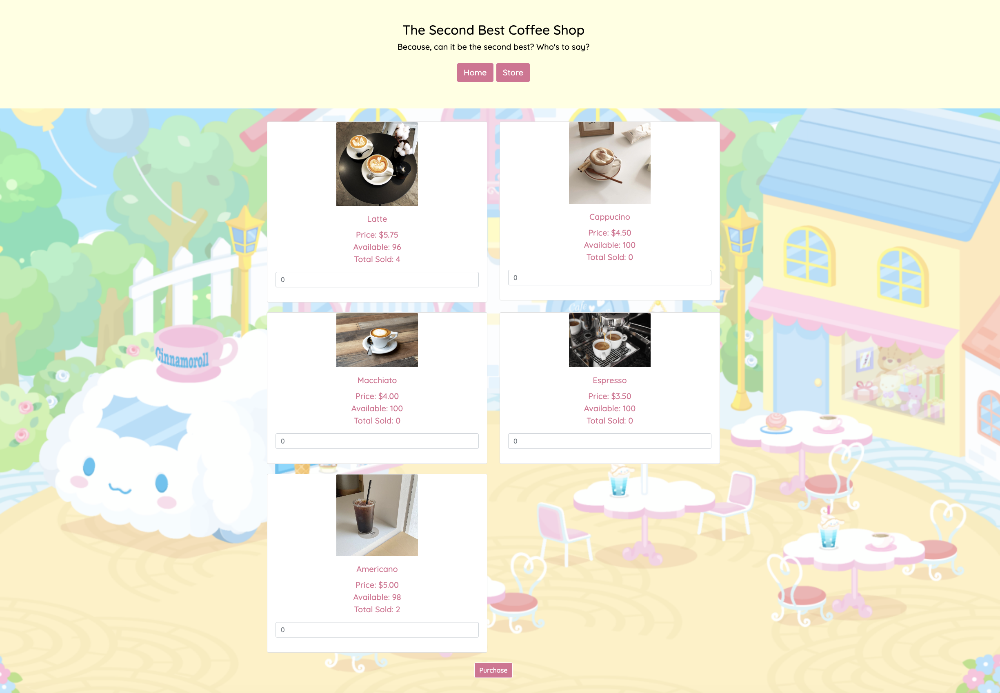

Reflecting on my programming journey, I can confidently say that my skills have seen siginificant improvement in 
various aspects. One notable progress is in problem-solving. Engaging in a variety of challenges hence Assignment 1 
has honed my ability to approach challenges systematically and come up with efficient solutions. Innitially, I struggled 
with tackling complex problems, but through consistent practice, I now find myself more adept at breaking down tasks and 
devising effective strategies to implement solutions, especially while using ChatGPT as a resource.

However, despite these advancements, there are areas that demand my attention for further enhancement. One aspect that 
I need to focus on is refining my code optimization skills. While I can create functional programs, there is room for improvement 
in terms of writing more efficient and concise code. Working on this aspect will not only enhance the performance of my programs 
but also contribute to better coding practices overall.

The POKEs have been instrumental in my learning process. Initially, I relied heavily on screencasts to guide me through these 
exercises, but gradually, I have developed the ability to tackle them more independently. This shift from dependence on 
screencasts to self-sufficiency has been a crucial milestone in my programming journey, indicating that I am gaining a 
deeper understanding of the concepts and tools.

The labs have been a valuable resource, providing me with a structured envrionment to apply theoretical knowledge to practical 
scenarios. Completing these labs has significantly boosted my confidence in implementing what I've learned during lectures. 
I find myself not only completing them successfully, but also understanding the underlying principles that govern each task.

Moving from Assignment 1 to Assignment 2, I feel a sense of accomplishment and readiness, along with nervousness. The challenges 
presented in Assignment 1 served as a comprehensive learning experience, pushing me to think critically and apply my skills 
in a real-world context. I now approach Assignment 2 with a solid foundation and the confidence to tackle more complex problems.

While the class has been immensely beneficial, there are areas where improvements could enhance the learning experience. 
One suggestion is to incorporate more real-world projects or case studies. Practical application of programming skills in 
authentic scenarios can provide a more holistic understanding of the subject and better prepare students for future challenges 
in the field. 

In terms of what aids my learning the most in class, it's a combination of various elements. POKEs and labs provide hands-on 
experience and practical application of concepts, solidifying my understadning. The class website serves as a centralized hub for 
resources and announcements, ensuring I stay organized and well-informed. Screencasts are helpful for initial guidance, especially 
when encountering new concepts. However, what truly stands out is the collaborative aspect - being able to easily access Discord, working with 
classmates and engaging in one-on-one discussions or seeking help from instructors. These interactions foster a dynamic 
learning environment where I not only learn from the material but also from the diverse perspective and approaches for my peers.
